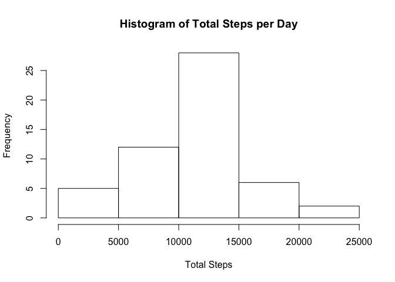
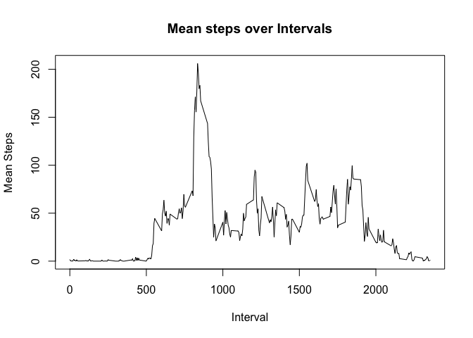
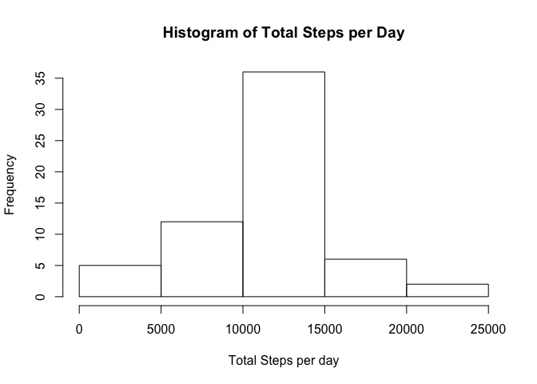
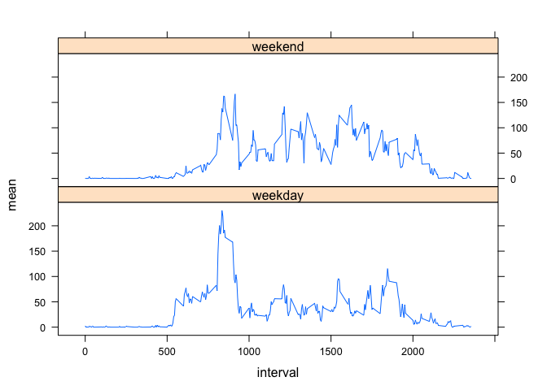

# Reproducible Research: Peer Assessment 1


## Loading and preprocessing the data


```r
library(plyr)
library(lattice)

data = read.csv(file=unz(description="./activity.zip", filename="activity.csv"))
# convert the string to date time
data$date = as.Date(data$date, format="%Y-%m-%d")
```


## What is mean total number of steps taken per day?


```r
totalSteps = ddply(data, "date", summarise, total=sum(steps))
hist(totalSteps$total, xlab="Total Steps", main="Histogram of Total Steps per Day")
```



```r
mean(totalSteps$total, na.rm=TRUE)
```

```
## [1] 10766.19
```

```r
median(totalSteps$total, na.rm=TRUE)
```

```
## [1] 10765
```


## What is the average daily activity pattern?


```r
dailyPattern = ddply(data, "interval", summarise, mean=mean(steps, na.rm=TRUE))
plot(dailyPattern$interval, dailyPattern$mean, type="l", xlab="Interval", ylab="Mean Steps", main="Mean steps over Intervals")
```



```r
# Max 5-Minute Interval
dailyPattern[dailyPattern$mean == max(dailyPattern$mean), c("interval")]
```

```
## [1] 835
```


## Imputing missing values


```r
# Number of rows missing data
nrow(data[is.na(data$steps)|is.na(data$date)|is.na(data$interval),])
```

```
## [1] 2304
```

```r
# Helper function for filling in missing data
fillMeanRow = function(interval, steps) {
  if (is.na(steps)) return(dailyPattern[dailyPattern$interval == interval, "mean"])
  return(steps)
}

# Fill in missing data with mean values from dailyPattern
meanStepData = adply(data, 1, transform, steps=fillMeanRow(interval, steps))
totalStepsPerDay = ddply(meanStepData, 'date', summarise, total=sum(steps))
hist(totalStepsPerDay$total, xlab="Total Steps per day", main="Histogram of Total Steps per Day")
```



```r
mean(totalStepsPerDay$total)
```

```
## [1] 10766.19
```

```r
median(totalStepsPerDay$total)
```

```
## [1] 10766.19
```

There is a difference between the original median and the new imputed median, which is now equal to the mean given the strategy. Before the rows were filtered out but now the 2304 rows are included in the mean & median calculation.


## Are there differences in activity patterns between weekdays and weekends?


```r
# Introduce new factor variable

weekends = c("Saturday", "Sunday")

meanStepData$weektype = ifelse(weekdays(meanStepData$date) %in% weekends, "weekend", "weekday")

meanIntWeekType = ddply(meanStepData, c("interval", "weektype"), summarise, mean=mean(steps))

xyplot(mean ~ interval | weektype, data=meanIntWeekType, layout=c(1, 2), type="l")
```



